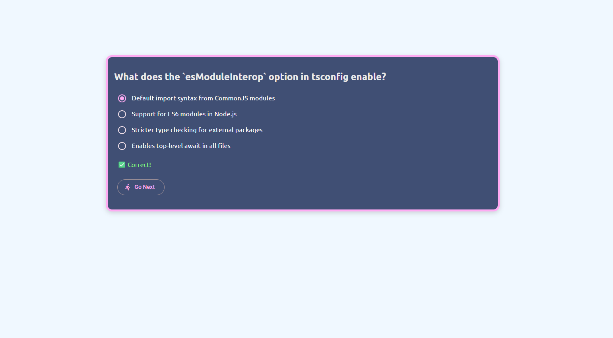

| Layer                        | Tool                                                                 |
| ---------------------------- | ------------------------------------------------------------------------- |
| **Component-local State**    | 🔹 **Signals** – reaktiv, performant, einfach, ideal für UI-Interaktionen |
| **Shared State (App-weit)**  | 🔹 **NgRx Signal Store** *(neuer Store auf Signals)* ODER                 |
|                              | 🔹 **Angular Signal Inputs/Outputs + Services mit Signals**               |
| **Side Effects / API Calls** | 🔹 **Effects (NgRx Signal Store)** oder **Services mit `inject()`**       |
| **Feature-Modularisierung**  | 🔹 **Standalone Components + Route-basiertes Lazy Loading**               |
| **Formulare & Validierung**  | 🔹 **Reactive Forms** (Template Forms für kleine Fälle, sonst vermeiden)  |
| **Styling & UI**             | 🔹 **SCSS oder Tailwind**, gutes Designsystem wie **Material** nutzen     |


# AngularLibs

This project was generated using [Angular CLI](https://github.com/angular/angular-cli) version 20.0.1.

## Development server

To start a local development server, run:

```bash
ng serve
```

Once the server is running, open your browser and navigate to `http://localhost:4200/`. The application will automatically reload whenever you modify any of the source files.

## Code scaffolding

Angular CLI includes powerful code scaffolding tools. To generate a new component, run:

```bash
ng generate component component-name
```

For a complete list of available schematics (such as `components`, `directives`, or `pipes`), run:

```bash
ng generate --help
```

## Building

To build the project run:

```bash
ng build
```

This will compile your project and store the build artifacts in the `dist/` directory. By default, the production build optimizes your application for performance and speed.

## Running unit tests

To execute unit tests with the [Karma](https://karma-runner.github.io) test runner, use the following command:

```bash
ng test
```

## Running end-to-end tests

For end-to-end (e2e) testing, run:

```bash
ng e2e
```

Angular CLI does not come with an end-to-end testing framework by default. You can choose one that suits your needs.

## Additional Resources

For more information on using the Angular CLI, including detailed command references, visit the [Angular CLI Overview and Command Reference](https://angular.dev/tools/cli) page.
